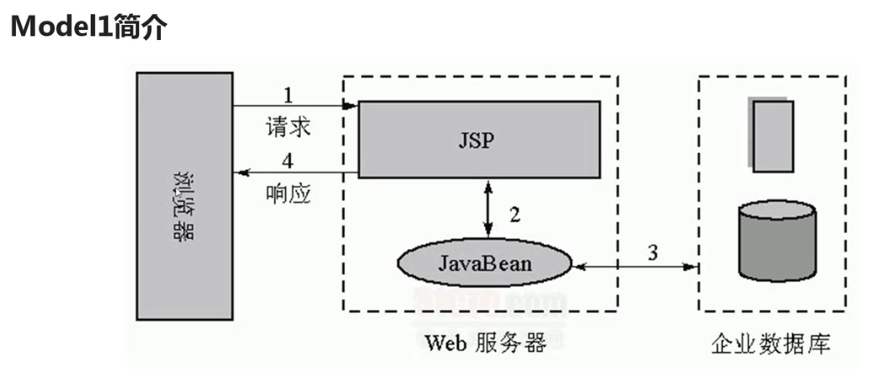

# JSP学习笔记

## Tomcat

### Tomcat目录结构

    /bin      # 存放各种平台下用于启动或停止Tomcat的命令文件
    /conf     # 存放Tomcat服务器的各种配置文件
    /lib      # 存放Tomcat服务器所需的各种jar文件
    /logs     # 存放Tomcat的日志文件
    /temp     # Tomcat运行时用于存放临时文件
    /webapps  # 当发布Web应用时，默认会将Web应用的文件发布到此目录中
    /work     # Tomcat把由JSP生成的Servlet放于此目录下

### WEB-INF目录结构

WEB-INF是Java Web应用的安全目录。所谓安全就是客户端无法访问，只有服务端可以访问的目录。
web.xml，项目部署文件。
classes文件夹，用于放置*.class文件。
lib文件夹，用于存放需要的jar包。

### 修改Tomcat服务器默认端口

修改conf/server.xml文件

    <Connector port="8080" protocol="HTTP/1.1"
               connectionTimeout="20000"
               redirectPort="8443" URIEncoding="utf-8"/>

### 设置session超时时长

在web.xml配置

    <session-config>
        <session-timeout>10</session-timeout>
    </session-config>

## JSP基础语法

### JSP页面元素构成

**指令、表达式、小脚本、声明、注释、静态内容**

### JSP指令

**page指令：** 通常位于jsp页面的顶端，同一个页面可以有多个page指令。
**include指令：** 将一个外部文件嵌入到当前的jsp文件中，同时解析这个页面中的jsp语句。
**taglib指令：** 使用标签库定义新的自定义标签，在jsp页面中启用定制行为。

### JSP注释

    <!--HTML注释-->
    <%--JSP注释-->
    //单行注释
    /*
     * 多行注释
     */

### JSP脚本

在JSP页面中执行的Java代码。

    <% Java代码 %>

### JSP声明

在JSP页面中定义变量或者方法。

    <%! Java代码 %>
### JSP表达式

在JSP页面中执行的表达式。

    <%=表达式 %>

### JSP页面生命周期

**编译阶段：**servlet容器编译servlet源文件，生成servlet类。
**初始化阶段：**加载与JSP对应的servlet类，创建其实例，并调用它的初始化方法。
**执行阶段：**调用与JSP对应的servlet实例的服务方法。
**销毁阶段：**调用与JSP对应的servlet实例的销毁方法，然后销毁servlet实例。

## JSP内置对象

JSP内置对象是Web容器创建的一组对象，不使用new关键字就可以使用的内置对象。

**九大内置对象：**out, request, response, session, application, page, pageContext, exception, config

### out对象

out对象是JspWriter类的实例，是向客户端输出内容常用的对象。

### request对象

客户端的请求信息被封装在request对象中，通过它才能了解到客户的需求，然后做出响应。它是HttpServletRequest类的实例。request对象具有请求域，即完成客户端的请求之前，该对象一直有效。

### response对象

response对象包含了响应客户请求的有关信息，但在JSP中很少直接用到它。它是HttpServletResponse类的实例。response对象具有页面作用域，即访问一个页面时，该页面内的response对象只对这次访问有效，其它页面的response对象对当前页面无效。

### session对象

session对象是一个JSP对象，在第一个JSP页面被装载时自动创建，完成会话期管理。session对象是HttpSession类的实例。

### application对象

application对象实现了用户间的数据共享。可存放全局变量。application开始于服务器的启动，终止于服务器的关闭。在用户的前后连接或不同用户之间的连接中，可以对application对象的同一属性进行操作。在任何地方对application对象的属性的操作，都影响到其他用户对此的访问。
服务器的启动和关闭决定了对application对象的生命。
application对象是ServletContext类的实例。

### page对象

page对象就是指向当前JSP页面本身，有点像类中的this指针，它是java.lang.Object类的实例。

### pageContext对象

pageContext对象提供了对JSP页面内所有的对象及名字空间的访问。pageContext对象可以访问到本页所在的session，也可以取本页面所在的application的某一属性值。pageContext对象相当于页面所有功能的集大成者。pageContext对象的本类名也叫pageContext。

### config对象

config对象是在一个Servlet初始化时，JSP引擎向它传递信息用的，此信息包括Servlet初始化时所用到的参数（通过属性名和属性值构成）以及服务器的有关信息（通过传递一个ServletContext对象）。

### exception对象

exception对象是一个异常对象，当一个页面在运行过程中发生了异常，就产生这个对象。如果一个JSP页面要应用此对象，就必须把isErrorPage设为true，否则无法编译。它实际上时java.lang.Throwable的对象。

## JavaBeans

JavaBeans就是符合某种特定规范的Java类。

JavaBeans设计原则：公有类、无参的公有构造方法、属性私有、getter方法和setter方法。

### Jsp动作元素

动作元素为请求处理阶段提供信息。动作元素遵循XML元素的语法，有一个包含元素名的开始标签，可以有属性、可选的内容、与开始标签匹配的结束标签。

**与存取JavaBean有关的：**

    <jsp:useBean>
    <jsp:setProperty>
    <jsp:getProperty>

**是JSP1.2就开始有的基本元素：**

    <jsp:include>
    <jsp:forward>
    <jsp:param>
    <jsp:plugin>
    <jsp:params>
    <jsp:fallback>

**是JSP2.0新增的元素，主要与JSP Document有关：**

    <jsp:root>
    <jsp:declaration>
    <jsp:scriptlet>
    <jsp:expression>
    <jsp:text>
    <jsp:output>

**是JSP2.0新增的动作元素，主要用来动态生成XML元素标签的值：**

    <jsp:attribute>
    <jsp:body>
    <jsp:element>

**是JSP2.0新增的动作元素：**

    <jsp:invoke>
    <jsp:dobody>

### JavaBeans的四个作用域范围

使用useBeans的scope属性可以用来指定JavaBeans的作用范围。

    page        # 仅在当前页面有效。
    request     # 可以通过HttpRequest.getAttribute()方法取得JavaBeans对象。
    session     # 可以通过HttpSession.getAttribute()方法取得JavaBeans对象。
    application # 可以通过application.getAttribute()方法取得JavaBeans对象。

### Model1

JSP　+ JavaBeans的开发模式：

## JSP状态管理

保存用户状态的两大机制：Session和Cookie
