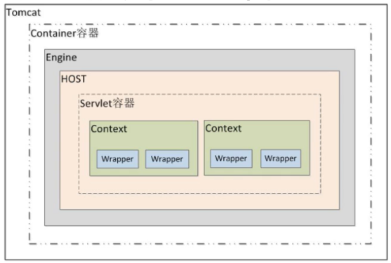
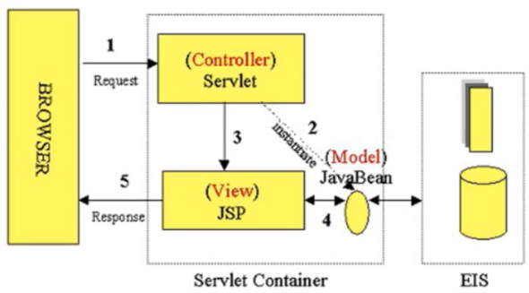

# Servlet学习笔记

## 什么是Servlet

Servlet是在服务器上运行的小程序，一个Servlet就是一个Java类，并且可以通过“请求-响应”编程模型来访问的这个驻留在服务器内存里的Servlet程序。

## Tomcat容器等级

Tomcat容器分为四个等级，Servlet的容器管理Context容器，一个Context对应一个Web工程。

## Servlet基础

### 编写Servlet类

(1) 继承HttpServlet

(2) 重写doGet()或者doPost()方法

(3) 在web.xml中注册Servlet

    <servlet>
        <servlet-name>servlet类名</servlet-name>
        <servlet-class>servlet的类路径</servlet-class>
    </servlet>
    <servlet-mapping>
        <servlet-name>servlet类名（与上面对应）</servlet-name>
        <url-pattern>请求的url路径</url-pattern>
    </servlet-mapping>

### Servlet生命周期

(1) 初始化阶段，调用init()方法；

(2) 响应客户请求阶段，调用service()方法。由service()方法根据提交的方式选择执行doGet()或者doPost()方法；

(3) 终止阶段，调用destroy()方法。

**在以下时刻Servlet容器装载Servlet：**

(1) Servlet容器启动时自动装载某些Servlet，实现它只需要在web.xml文件中的<servlet></servlet>之间添加如下代码：

    <load-startup>1</load-startup>    # 数字越小表示优先级别越高

(2) 在Servlet容器启动后，客户首次向Servlet发送请求。

(3) Servlet类文件被更新后，重新装载Servlet。

## Servlet高级

### 获取初始化参数

在web.xml中配置Servlet时，可以配置一些初始化参数。而在Servlet中可以通过ServletConfig接口提供的方法来获取这些参数。

    <servlet>
        <init-param>
            <param-name>paramname</<param-name>
            <param-value>paramvalue</param-value>
        </<init-param>
    </servlet>

### MVC模型

MVC（Model、View、Controller）是软件开发过程中比较流行的设计思想。旨在分离模型、控制、视图，是一种分层思想的体现。

### Model2模型介绍

JavaWeb的Model2开发模型就是MVC思想的体现。

